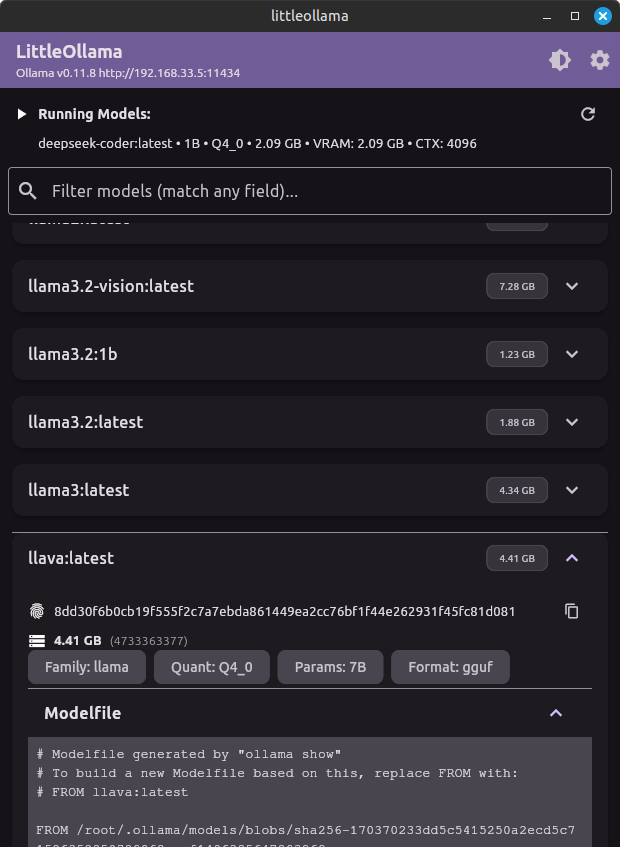
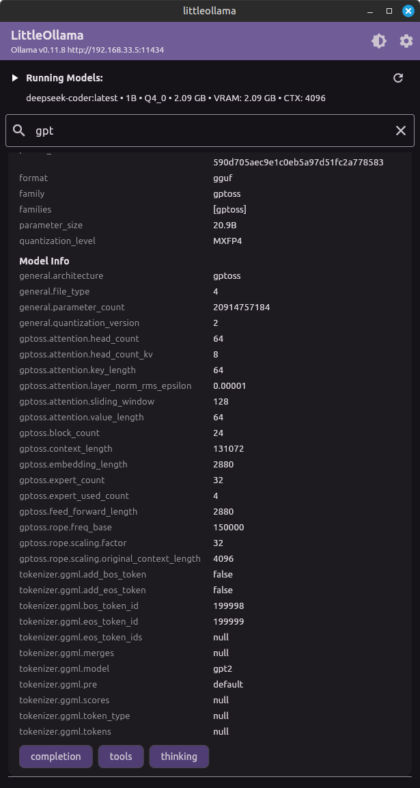
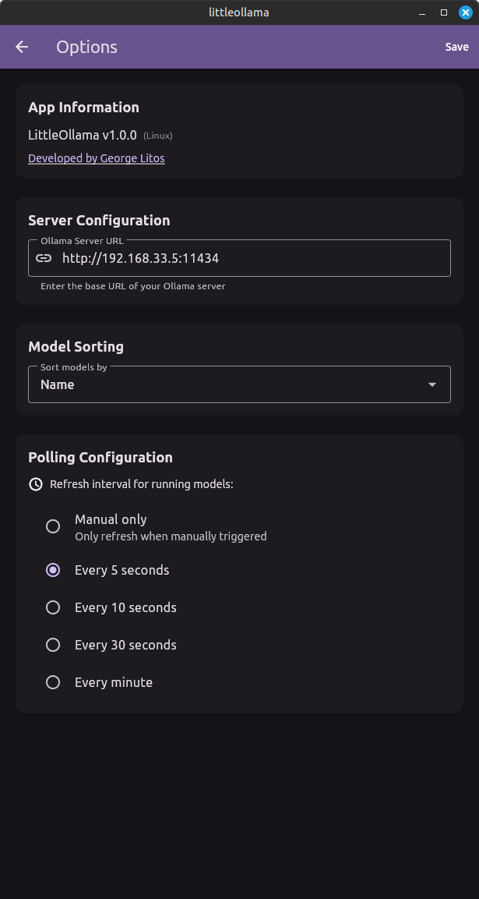

# littleollama

A cross-platform info tool for [Ollama](https://ollama.com/), built with Flutter.

## Features

- **Model List & Filtering**
  - Displays all available Ollama models in a scrollable list.
  - Filter models by name or key properties.
  - Sort models by name, size, family, or last modified date.

- **Expandable Model Details**
  - Each model is shown in a card with an expandable section.
  - Key metadata displayed: family, quantization level, parameter size, format, digest, and size.
  - Details are shown in a clean, readable key-value format.

- **Advanced Model Info via API**
  - On expansion, fetches extra model information from the backend (`POST /api/show`).
  - Displays:
    - Modelfile (collapsible, copyable)
    - Parameters (collapsible, copyable)
    - Template (collapsible, copyable)
    - Technical details and model info (key-value rows)
    - Capabilities (shown as chips)
  - Hides irrelevant or empty fields for clarity.

- **Theme Support**
  - Light, dark, and system themes.
  - Theme can be changed from the app bar.

- **Error Handling & User Feedback**
  - Beautified error messages with retry options.
  - Loading indicators for network operations.

- **Settings & Options**
  - Configure Ollama server endpoint.
  - Set polling interval and sort options for model list.
  - Options screen accessible from the app bar.

- **Cross-Platform**
  - Runs on desktop, mobile, and web (Flutter).

## Getting Started

1. Install [Ollama](https://ollama.com/) and start the server.
2. Run this app with Flutter (`flutter run`).
3. Configure the endpoint and options as needed.

## License

MIT

## Screenshots

